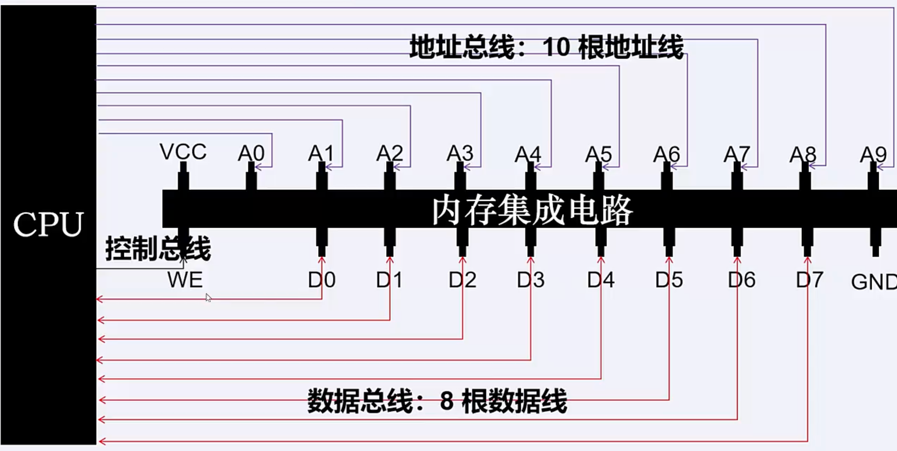

# 基础知识
## 计算机组成
现代计算机遵循经典的冯·诺依曼架构，冯·诺依曼架构有如下三个特点<br>
* 由输入设备、输出设备、存储器、运算器以及控制器组成
* 计算机内部用二进制表达指令和数据
* 程序事先编写好存放在磁盘内，存放后启动计算机，程序就可以执行了
冯·诺依曼架构如图

**存储器**：存放数据和程序<br>
**运算器**：完成算术运算和逻辑运算<br>
**输入设备**：将人类熟悉的信息转换为机器能识别的信息（鼠标、键盘）<br>
**输出设备**：运算结果输出为人类熟悉的信息形式（打印机、显示器）<br>
**控制器**：控制、指挥程序的运行
## CPU
前文中我们已经知道计算机的组成部分，其中运算器（ALU）和控制器（CU）再加上一些寄存器就组成成了我们常说的CPU，CPU的主要功能就是**取值计算**，从内存中读取指令（取址），然后解读指令（解码）最终执行计算（计算），这就是CPU的主要工作
### 指令集
内存中存储的二进制，那么CPU是如何知道做什么的呢，那就是通过制定指令的前几位二进制作为*操作码*，不同的CPU生产厂商所提供的操作码不同，操作码的集合称之为指令集，通过指令集，CPU就能够知道这个指令需要执行什么操作
### CPU中的寄存器
我们知道，CPU需要不断地从内存中获取指令并执行指令，那么CPU和内存是如何通信，内存的数据又存放在哪儿呢？答案是通过总线和寄存器<br>
**总线**<br>
CPU和内存之间通信通过以下三个总线
* 地址总线：传输内存地址
* 控制总线：传输控制信息，对于内存地址是读还是写
* 数据总线：用于内存和CPU之间传输数据<br>

**寄存器**<br>
寄存器的功能很多，有用于计算的寄存器，用于函数调用的寄存器等等，比较常见的寄存器有以下4类
* MAR：地址寄存器，存放将要被访问的存储单元地址
* MDR：数据寄存器，存放想要写入主存或者从主存中读取的数据
* PC：程序计数器，存放下一条要执行的指令的地址
* IR：指令寄存器，存放当前要执行的指令
## 内存
内存是用于存放数据的，物理实现来讲是由一系列的存储芯片组成，最基本的组成电路为*门锁*电路<br>
**门锁**<br>

门锁的电路符号<br>

门锁的串并联，就组成了我们的内存

### 程序员眼中的内存
作为程序员，我们并不需要太关注内存的物理实现，所以我们一般把内存抽象成一个连续的内存空间，在操作系统中将其抽象为地址空间

同时，由存放时的顺序不同带来的字节序的差异，我们分为大端序和小端序

对于人类而言，小端序更容易阅读，但对于计算机而言，大端序是更好的选择，因为有效数据放在了低地址，可以提高数据访问的效率
程序执行的过程其实就是CPU不断的从内存中读取指令然后执行指令的过程，下面我们来看程序到底是如何运行的
# 程序是如何运行的
程序其实就是事先编写好的文本文件，这些文件被存放到磁盘里，程序运行的时候需要将磁盘的磁盘文件事先加载到内存中，然后通过CPU和内存的交互来执行；所以，程序的运行过程其实就是CPU从内存中取指执行的过程，那么CPU是如何实现取指执行的呢，答案是通过寄存器，下面我们来看例子
## 函数调用栈
先看如下一段C语言代码
```C
#include<stdio.h>
int mod(int a, int b){
    return a % b;
}

int add(int a, int b){
    int res = mod(a, b);
    return res + b;
}

void main(){
    int a = 2;
    int b = 3;
    int c = add(a, b);
}
```
从函数调用关系来讲，*main*函数调用了*add*函数，*add*函数调用了*mod*函数<br>
从函数调用的角度来看，函数执行的顺序是“main -> add -> mod”，而从函数的完成顺序来看是“mod -> add -> main”，符合*LIFO(后进先出)*原则，这是**栈**这种数据结构的典型特性，因此，在函数调用上，操作系统采用的函数调用栈来实现<br>

函数调用栈的栈顶位于低地址，栈底位于高地址，这样的做的目的是因为，栈是动态扩展的，内存有限时，向上扩展容易导致内存溢出，向下的话能够避免出现内存溢出的情况

### rip、rbp、rsp寄存器
CPU是通过rip、rbp以及rsp三个寄存器实现的，rip其实就是前文讲到的IP寄存器，只不过是64位操作系统上的IP寄存器称之为rip
* rbp：栈桢基址寄存器，存放栈桢的基地址
* rsp：栈桢栈顶寄存器，存放栈桢的栈顶地址
* rip：指令指针寄存器，存放下一条要执行的指令的内存地址
* 栈桢：函数调用栈的元素成为栈桢，栈桢存放*返回地址*、*参数值*、“局部变量”三个数据

前置命令
```shell
# 编译
gcc -g -c xxx.c
# 产生可执行文件
gcc -o xxx.exe xxx.o
# 反汇编
objdump -d -M intel xxx.o
```
### 汇编指令
将人类易读的程序翻译成计算机能识别的机器码的过程称之为编译，将机器码翻译成汇编语言的过程称之为反编译，将.o文件进行反汇编以后，能看到如下内容


我们可以看到，反汇编内容分为三列
* 第一列：偏移地址，相对于函数基地址的偏移地址
* 第二列：指令，指出是个什么操作
* 第三列，指令的操作对象

**函数调用相关汇编指令解析**<br>
**push rbp**：将rbp压入函数调用栈<br>
1. rsp下移一个元素
2. rsp指向的内存地址的内存空间写入当前rbp的内存地址

**mov rbp,rsp**: 将rsp存放的值赋给rbp，此时rbp和rsp指向同一片内存空间<br>
**call 64<main+0x25>**: 调用add函数
1. 将rip指向下一条要执行的指令
2. rip指向的内存地址入栈并返回地址
3. 将rip指向被调用的函数地址
 
**pop rbp**: 出栈
1. rbp设置为当前内存地址存放的值
2. rsp回退一个元素

**ret**: 函数返回
1. rip设置为rsp指向的地址

**leave**：
1. mov rsp, rbp
2. pop rbp

