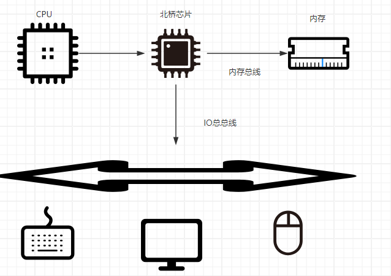
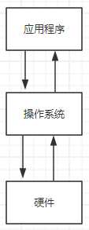

# 操作系统
## 概述
学习操作系统之前我们需要知道为什么需要操作系统？以及操作系统是做什么的？ 
根据前面学过的计算机组成原理，我们知道计算机是由硬件组成的，程序的执行过程是CPU从内存中不断地取指执行的过程，但是回顾正常的使用场景下，我们大部分的应用程序不仅是需要CPU和内存，还需要诸如显卡、显示器、键盘、鼠标等等一系列外设，那么程序的执行都是需要和外设打交道的 

此时，我们发现了一个问题，如果每个应用程序都直接地和外设硬件打交道，那么每一个应用程序的开发将会机器困难，因为每一个都要直接的去操作硬件设备，这是非常复杂的，那么如何解决呢？ 
软件工程中有句名言“任何复杂问题都可以加一个中间层”来解决，那么硬件和应用程序之间的**中间层**就是我们的操作系统，操作系统主要有以下两大功能:
* 对应用程序提供接口，使得应用程序通过操作系统来操作硬件
* 对硬件进行操作完成各项程序任务

除了以上两大功能外，从程序的运行角度来讲，操作系统还有一个重要的调度功能来调用应用程序，换句话讲，应用程序的执行依赖于操作系统的调度，一个很直观的问题，内存只有一块，不同的应用程序都要访问内存，如何避免内存冲突、如何避免硬件调度的冲突，这也是操作系统需要去处理的，因此，操作系统也是非常重要的调度程序

## 基础知识
### 计算机的启动过程
操作系统其实也是程序，既然是程序，那么事先还是被存放在磁盘里的，我们的计算机是如何加载操作系统呢，这个就需要了解计算机的启动过程，了解之前我们需要知道两个东西：
* BIOS（Basic IO System）：基本IO系统，这个是计算机启动时开启的第一个程序
* bootloader：操作系统加载程序，用于将操作系统加载到内存中进行执行

计算机启动过程如下：
* 设备上电：CPU、内存等硬件开始工作，BIOS启动
* BIOS从磁盘中加载bootloader到内存：bootloader存放于磁盘的第一个扇区（ROM：只读存储）
* bootloader加载操作系统到内存
* 操作系统工作，加载各类应用程序
### 内核态和用户态
从上可以看出，操作系统调度应用程序执行，那么如果应用程序都具备完全的访问硬件的能力，显然存在安全隐患，那么对于硬件等一些高危指令的执行，必须只能由操作系统执行，其他程序想要执行也只能通过操作系统，因此我们将程序的执行时CPU所处的状态分为：
* 内核态：操作系统运行时CPU的状态，可以执行CPU指令集的所有指令
* 用户态：应用程序运行时CPU所处的状态，只能执行有限的指令

因此，内核态和用户态主要的区别在于指令的执行权限上，结合实例，如果我们要操作硬件设备，那么程序是需要切换到内核态执行的

## 设备控制器
我们清楚操作系统是需要和硬件打交道的，但是操作系统本身也不是直接和硬件本身打交道，而是与设备的设备控制器打交道，设备控制器一般由**命令寄存器、数据寄存器、状态寄存器以及控制电路**组成
* 命令寄存器：执行设备命令
* 数据寄存器：存放cpu发过来的数据
* 状态寄存器：标志设备是否可用的状态
* 控制电路：发送电信号给设备，让设备进行各种操作

但是我们面临着又一个问题，一个计算机有很多的外设，操作系统如何知道每一个外设呢？ 
这里有两种方法:
* 内存映射：将设备寄存器进行编址从而映射到一片特定的内存空间，对内存空间的操作就是对设备idea操作
* 端口映射：将寄存器映射到端口上，通过与端口的通信，就是对设备的操作

内存映射和端口映射是目前非常常见的两种方式
## 中断机制
从前文我们知道，可以通过系统调用的方式调用程序执行，但是有一个问题，CPU同一时间只能执行一条指令，那么当我们操控设备执行时，CPU只能等待这个任务执行完成，才能开始其他任务，这就带来了一个等待时间，等待时间是对CPU资源的浪费，我们希望在等待时间内可以去做其他的事情，当前设备IO的事情做完后再回到原来的地方，而且基于前面函数调用的学习，我们知道函数调用的本质其实时依赖于栈帧，那么我们只需要将rip等一系列寄存器的状态保存好，就可以执行其他任务，IO完成后再将寄存器状态恢复，就可以继续原来的内容了，实现这一操作的就是**中断机制** 
我们以键盘输入为例，当我们在键盘上按下字母时，其实就是键盘通过设备控制器触发了一个操作系统的中断，从而让操作系统接受输入并将输入打印到屏幕上。中断机制的实现依赖于中断向量表，中断向量表其实就是一系列的中断号，每一个中断号对应一个中断程序的内存地址，通过这样的方式实现了中断 
中断的过程大致分为：
* 保存当前状态
* 执行其他程序
* 恢复执行状态

