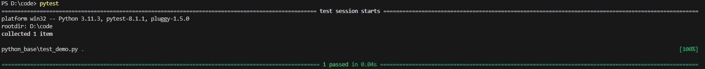
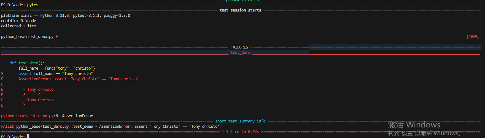
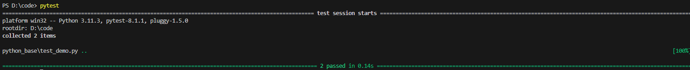
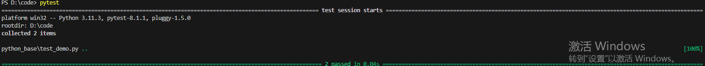
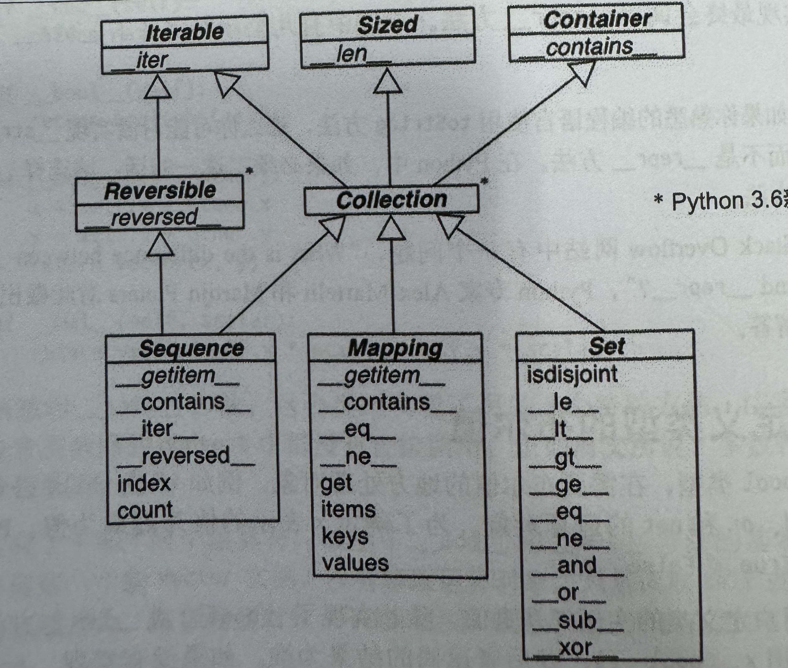

# 变量
变量理解为指向特定的值<br>
**变量命名规则**
* 变量名只能采用字母、数字以及下划线组成
* 只能以字母、下划线开头
* 变量名一般采用小写，单词之间用下划线隔开，应当见名知意
* 慎用小写l和大写O
* 不要将python关键字和函数名作为变量名
# 数据类型
## 字符串
在python中用引号（单引号'' 或 双引号""）括起来的都是字符串
```python
str1 = 'hello world'
str2 = "hello world"
```
这样的灵活组合是为了方便能够在字符串中组合引号和撇号<br>
**字符串常用方法**<br>
```python
str = 'test'
str = str.title() # 首字母大写，其余小写
str = str.upper() # 全大写
str = str.lower() # 全小写
```
>上述方法都是临时修改，如果要永久修改则需要将变量指向改变后的字符串<br>

**空白字符**<br>
```python
# python中空白字符包括一切控制台不直接打印的字符，包括制表符（\t）换行符（\n）
str1 = 'hello '
str2 = '\thello\t'
str3 = '\nhello\n'
# 删除空白字符方法：rstrip() 删掉右侧空白字符，strip() 删掉首尾空白字符, lstrip() 删掉左侧空白字符
str1.rstrip()
str2.strip()
str3.lstrip()
```
>上述方法用于删除右侧、首尾、左侧的空白字符，空白字符不仅是空格，还包括换行符、制表符等控制台不直接显示的字符<br>

**字符串引用变量**
```python
name = 'tom'
str1 = f'{name} is my brother' # f字符串
str2 = "{} is my brother".format(name) # format方法
str3 = "%s is my brother" % (name) # %运算符
```

上述这种方式分别称为:
* “f字符串”，用于在字符串中引用已有变量，用花括号将变量括起来；此方法适用于python 3.6及以上版本
* format方法，空的花括号表示变量要插入的位置
* %运算符, %s表示变量位置以及变量类型

## 数
**整数运算**<br>
```python
# 整数运算主要有：+、-、*、/、//、%
# 位运算主要有：&、|、!、~、>>、<<、^
a, b = 2, 3 # 一次性赋值多个变量
c = 10_000_000 # 下划线分割较大数字，python会忽略下划线
COUNT = 20 # 常量，python并未内置常量，一半将全大写变量认为是常量
print(c)
print(a * b) # 乘法运算
print(a ** b) # 幂运算
print(a / b) # 除法运算
print(a - b) # 减法运算
print(a + b) # 加法运算
print(b // a) # 整除
print(b % a) # 取模
# 位运算
print(a >> 2) # 右移2位
print(a << 2) # 左移2位
print(a & b) # 与运算
print(a | b) # 或运算
print(a ^ b) # 异或运算
print(~ a) # 按位取反
```
浮点数与整数运算一样，值得注意的是：*除法的结果总为浮点数*，有浮点数参与的运算，结果总为浮点数<br>
## 列表
**列表**由一系列按特定顺序排列的元素组成，这里的元素可以是任意元素类型和内容；由方括号括起来<br>
```python
lists = [1, 2, 3,, 4, 5] #列表定义
len(lists) # 获取列表长度
```
访问列表元素可以直接通过索引(index)访问，注意，*索引从0开始*
```python
print(lists[0])
print(lists[1])
print(lists[-1]) # 对于列表末尾元素，python提供了页数访问方法，索引-1表示最后一个元素，-2.-3依次表示倒数第二个、倒数第三个
```
**列表元素的增、删、改**
```python
lists.append(1) # 在列表末尾增加元素0
lists.insert(1, 10) # 在列表索引1处插入元素10

del lists[0] # 删除列表索引0的元素
lists.remove[1] # 删除列表中第一个元素为1的元素
a = lists.pop() # 删除列表末尾元素并将该元素作为返回值返回
b = lists.pop(1) # 删除列表中索引为1的元素，并将该元素作为返回值返回

lists[1] = 20 # 修改列表中索引1处的元素值为20
```

**列表切片**<br>
*列表切片*是将列表的的一部分作为一个新的列表，视为原列表的子集
```python
lists_1 = lists[:3] # 列表索引从0到2的切片
lists_2 = lists[1:] # 列表索引从1到列表末尾的切片
lists_3 = lists[:] # 整个列表的完整切片，可以作为列表拷贝的一种方式
lists_4 = lists[1:3] #列表索引从1~2的切片
```
**列表排序**
```python
lists.sort() # 列表排序，原列表被排序
lists.sort(reverse=True)  # 反向排序

sorted(lists) # 临时排序，原列表不变
sorted(lists, reverse=True) # 临时反向排序，原列表不变

lists.reverse() # 反转列表，原列表改变
```
**数值列表**<br>
通常需要数值列表（元素都为数字），可以通过list和range()快速产生数值列表
```python
lists = list(range(1, 5)) # range产生1~5之间的整数（不包括5）
print(lists)
lists = list(range(1, 10, 2)) # range产生1~10之间的整数，整数之间间隔为2（1、3、4、7）
```

**列表推导式**<br>
利用for循环语句快速创建列表
```python
lists = [ value ** 2 for value in range(1, 5)] # 产生列表为[1, 4, 9, 16]
```

**元组**<br>
列表是可变的，在程序执行过程中会对列表进行增、删、改等操作对原列表进行改变，但我们有时对于某些数据不希望在程序执行过程中进行修改，这是，就可以采用**元组**<br>
**元组**是不可变的，不能对声明后的元组进行修改，如果要修改只能重新定义变量
```python
a = (2, 3)
a[0] = 1 # 会报错
a = (1, 3) # 只能重新声明变量进行改变
```
## 字典
字典是由一系列*键值对*组成的动态结构，字典的值可以是任意python对象<br>
**定义字典**
```python
dict0 = {} # 定义一个空字典
dict0 =  {
    'name': 'Bob',
    'age': 0,
    } # 定义一个有元素的字典，键-值之间用冒号分割，键值对之间用逗号分隔
```
**字典增、删、改**
```python
dict0['name'] = 'Tom' # 新增一个键值对：'name': 'Tom'
dict0['name'] = 'Alice' # 修改'name'对应的值为'Alice'
del dict0['name'] # 删除name键值对
```

**遍历字典**
```python
print(dict0['name']) # 访问字典中name这个键对应的值
var = dict0.get('name', None) # 获取字典中name这个键的值，键不存在则返回None
# 遍历字典所有的键值对
for key, value in dict0.items():
    print(key, value)
# 遍历字典所有的键
for key in dict0.keys():
    print(key)
# 遍历字典中所有的值
for value in dict0.values():
    print(value)
```
**嵌套**<br>
嵌套一般是指列表和字典相互嵌套，列表字典、字典列表、字典嵌套字典、列表嵌套列表四种
```python
list_dict = [{'name': 'Tom', 'age': 18}, {'name': 'Alice', 'age': 16}] # 字典列表
dict_list = {
    'user': ['Alice', 'Bob', 'Tom'],
    'age': [61, 18, 24],
} # 列表字典
lists = [[1, 2, 3, 5,], [3, 6, 7, 8, 10]] # 列表中嵌套列表
dicts = {
    'Alice':{
       'name': 'Alice',
       'age': 16, 
    },
    'Tom':{
        'name': 'Tom',
        'age': 16,
    },
} # 字典中嵌套字典
```
# 流程控制
## if语句
**if语句**<br>
用于判断后面的的布尔表达式（紧跟在判断之后的表达式，计算结果为True或False），为True时执行冒号后缩进内容，否则不执行
```python
a = 10
if a > 0:
    print('{a} is greater than zero')
```
**if-else语句**<br>
当布尔表达式为True时执行if后跟着的缩进代码，为False时执行else后跟着的缩进代码
```python
a = -1
if a > 0:
    print('{a} is greater than zero')
else:
    print('{a} is less than zero')
```
**if-elif-else**<br>
此语句支持多个条件判定，根据需要，elif可以有很多个，if和elif中当布尔表达式为True时，则会执行对应的语句后缩进的代码，都不满足时则会执行else中的代码，注意：**else不是必要的**
```python
a = 0
if a > 0:
    print('{a} is greater than zero')
elif a == 0:
    print('{a} is equal to zero')
else:
    print('{a} is less than zero')
```
**逻辑运算符**<br>
逻辑运算符：与（and）、或（or）、非（not）<br>
逻辑运算符用于组合多个条件的结果<br>
算数比较：大于(>)，小于(<)，**等于(==)**，大于等于(>=)，小于等于(<=), 不等于(!=)<br>
算数比较符号用于比较数字的大小
```python
score = int(input("input students's score: "))
if a > 80:
    print("great")
elif a > 70 and a < 80:
    print("good")
elif a <= 70 and a >= 60:
    print('normal')
```
## 循环
### while循环
while循环是一种条件循环，当循环条件被满足时就会执行后续缩进的代码内容，当循环条件不满足时，就会退出循环<br>
特别需要注意循环体内一定要有促进循环结束的相关代码，否则就变成了死循环，大多数情况相爱，死循环不是一个好现象
```python
a = 0
while a < 10: # 只要a < 10成立就会进入循环
    print('loop, num is {a}')
    a += 1
```
### for循环
for循环常用于用于遍历一些元素，例如：列表，遍历结束时则循环结束
```python
a = [1, 2, 3, 4, 5]
for i in a: # 遍历a列表中的所有元素
    print(i)
```
### 循环控制
**braak与continue**<br>
break: 结束当前循环<br>
contiue: 结束当次循环，直接进入下一次循环
```python
for i in range(1, 100):
    if i > 50:
        print(i)
        break # 结束当前循环，执行循环体后面的语句
    elif i % 2 == 0:
        print('{i} is good num')
    else:
        continue # 进入下一次循环
print('done')
```
# 函数
函数是带有名字的代码块，通常用于完成某一项功能，在实际开发中，通过调用函数，可以减少冗余代码<br>
**函数定义**<br>
通过关键字def定义函数
```python
def func():
    pass
```
## 参数
```python
def print_info(first_name, last_name):
    print(f'hello {first_name} {last_name}')
print_info('Tony', 'christo')
```
上述代码可以看书，函数可以定义一些函数运行中需要从外部传入的参数，函数定义的参数称之为**形参**，实际运行中传入的参数称之为实参，调用过程可以理解成**实参赋值给形参**
### 位置参数
```python
def print_info(first_name, last_name):
    print(f'hello {first_name} {last_name}')
print_info('Tony', 'christo') # 打印'hello Tony christo'
print_info('christo', 'Tony') # 打印'hello christo Tony'
```
上述代码两次调用函数的结果并不相同，这就是位置参数，所谓位置参数，就是在有多个参数时，python仅通过传入参数的顺序将其提供给对应的形参，即使结果也许并不是我们想要的
### 关键字参数
```python
def print_info(first_name, last_name):
    print(f'hello {first_name} {last_name}')
print_info(first_name = 'Tony', last_name='christo') # 打印'hello Tony christo'
```
上述这种显示的指定形参与实参的方式称之为关键字参数，在函数调用时显示的指出形参与对应实参，下面这两种调用所得到的结果是一致的，由于显示的支出了形参和实参，因此顺序就不再影响函数的执行结果
```python
print_info(first_name = 'Tony', last_name='christo') # 打印'hello Tony christo'
print_info(last_name='christo', first_name = 'Tony') # 打印'hello Tony christo'
```
### 参数默认值
参数的默认值有两种用途<br>
1、为了提高代码的健壮性，我们需要提供给函数参数默认值以避免因调用问题导致的代码崩溃<br>
2、为了实现一些参数的缺省，有的参数不是所有情况下都一定会传入的，此时我们可以给不一定传入的参数指定一个默认值<br>
```python
def print_info(first_name, last_name, mid_name = None):
    if mid_name is None:
        print(f'hello {first_name} {last_name}')
    else:
        print(f'hello {first_name} {mid_name} {last_name}')
print_info('Tony', 'christo') # 打印'hello Tony christo'
print_info('Tony', 'christo', 'stack') # 打印'hello Tony stack christo'
```
值得注意的是，*带有默认值的参数定义时要放在没有默认值的参数后面*
### 不定项参数
想象这样一个场景，我写了一个函数，这个函数在未来也许还会有其他的参数传入，那么我想在函数定义时让函数具备一定的延展性，那该怎么做呢，此时可以用到不定项参数。<br>
***args**
```python
def print_info(first_name, last_name, *args):
    print(f'hello {first_name} {last_name}')
    for i in args:
        print(i)
print_info('Tony', 'christo', 'a', 'b', 'c', 'd')
```
上面的*args代表不固定数量的参数，这些传入的参数在执行过程中被转换成元组类型，可以通过访问元组元素的方式进行使用

****kwargs**
```python
def print_info(first_name, last_name, **kwargs):
    print(f'hello {first_name} {last_name}')
    for k, v in kwargs.items():
        print(f'{k}, {v}')
print_info('Tony', 'christo', dev='computer', favrite='bool')
```
上述的**kwargs也代表不固定数量的参数，这些传入的参数在执行过程中被转换成字典类型，因此可以通过访问字典的方式进行使用<br>
不定项参数使得我们在函数需要用心的参数实现新的功能时不必修改函数的定义，只需要传入新的参数，并新的参数执行即可，提高了代码的扩展性<注意>
如果要同时使用*args和\**kwargs，那么\*args要放在\**kwargs的前面
## 函数返回值
函数执行后返回给外部的内容称为**函数返回值**，任何的python对象都可以作为函数返回值，包括数字、列表、字典、字符串等，函数也可以作为函数返回值；通过**return**g
```python
def get_full_name(first_name, last_name):
    full_name = first_name + ' ' + last_name 
    return full_name.title()
```

## 通过模块导入函数
通过**from**、**import**关键字可以从指定模块文件中导入函数，还可以通过**as*关键字为导入的内容取别名<br>
demo.py
```python
def get_full_name(first_name. last_name):
    full_name = first_name + ' ' + last_name
    return full_name.title()
```
test.py
```python
from demo import get_full_name as format_name
full_name == format_name('tony', 'christo')
print(full_name)
```
# 类
**类**：一系列公共特征的抽象集合<br>
**实例**：由类创建的对象，这个过程称之为**类的实例化**<br>
```python
class Dog:
    """common dog class"""
    def __init__(self, name, age):
        self.name = name
        self.age = age
    
    def sit(self):
        print(f"{self.name} sits")
    
    def roll(self):
        print(f"{self.name} is rolling")

    def get_age(self):
        return self.age
```
上述示例中，**类中的函数**称之为**方法**，**类的变量**，如上述示例中的self.age、self.name称之为**属性**<br>
我们要特别注意"\_\_init\_\_"这个方法，这个方法会在实例创建时自动调用，开头和结尾的双下划綫是为了与其他普通方法区别开来<br>
self是一个特殊参数，这个参数是**对于实例本身的引用**，换句话说，这个变量始终指向实例自身<br>
## 类的继承
一些情况下我们不必从头到尾的完全写类的方法和属性，我们可以在已有类的基础上加上新增的属性和方法便能够更高效的创建新类这种方法也可以让我们更专注于新的特性上，**继承**机制提供了这样的途径
```python
class Car:
    def __init__(self, make, model, year):
        self.make = make
        self.model = model
        self.year = year
        self.odometer_reading = 0

    def get_descriptive_name(self):
        long_name = f"{self.year} {self.name}, {self.model}"
        return long_name.title()

    def read_odometer(self):
        print(f"this car has {self.odometer_reading} miles on it")


class ElectricCar(Car):
    def __init__(self, make, model, year):
        super().__init__(make, model, year)
        self.__battery_size = 40   

    def describe_battry(self):
        print(f"This car has  a {self.battery_size}-kmh battery.")

    def get_descriptive_name(self):
        print(f"{self.year} {self.make} {self.model} {self.__battery_size}")
```
上述代码我们需要关注*ElectricCar*这个类，*class ElectricCar(Car)*这个行代码表示ElectricCar是继承自Car类，继承的类能够访问父类的属性和方法，python提供了方法*super()*使得子类调用父类方法，如__init__方法中就通过super关键字调用了父类Car类中的__init__方法<br>
同时，我么注意导子类中有一个和父类同名的方法*get_descriptive_name*，这使得子类调用该方法时会调用子类实现的方法，并非父类，这种方式称之为*重写*<br>
我们还注意到，属性*__battery_size*相比于其他属性在开头多了双下划线，这表示这是一个私有变量，同理，方法名也可以这样，当你不希望外部直接访问这个属性或方法时，这是一个好的方式
 ## 类的导入
 在函数一章中，我们介绍了从模块中导入函数的方法，同样的，我们也能通过**from**、**import**、**as**进行类的导入和重命名；假设前面的类存放在名为car.py的模块文件中
 ```python
from car import Car as ca
from car import ElectricCar
imort car # 导入整个模块
from car import * # 导入模块中所有内容，不建议这样做，代码中看不出类的来源，可读性降低
```
# 文件读写
## **pathlib库**<br>
文件中存放着大量的信息，python中的*pathlib*可以帮助我们快捷的读取和写入文件，只需要提供文件的路径即可
```python
from pathlib import Path

if __name__ == "__main__":
    path = Path('python_base/demo_read.txt') # 提供文件路径创建Path对象
    info = path.read_text(encoding='utf-8')  # 以utf-8编码读取文件内容
    txt = ''
    for i in info.splitlines():              # 把读取到的内容分行来按行处理
        txt += i.rstrip()
    path = Path('python_base/demo_write.txt') # 再次提供文件路径创建一个Path对象
    path.write_text(txt)                      # 以utf-8编码将字符串写入到文件中 
    print(txt)
```
上述代码展示了如何通过三方库来进行文件读写，需要注意的是，write_text方法写入的一定是字符串类型的数据，其他类型的需要转换成字符串类型，下面展示另一种方式<br>
## 使用json文件保存数据
程序运行过程中的数据是存放在内存中的，程序运行结束时会伴随进程结束而销毁，所以及时的把需要的数据存入文件中是必要的<br>
**json文件**是一种好的存储格式，json并非python独有，而是一种通用的，因此，也方便共享给其他程序使用，这在多人、多语言开发是会起到很好的效果；python中提供了三方库json来针对json数据进行处理
```python
import json
from pathlib import Path
a = {"name": "Tom", "age": 24}
print(type(a))
path = Path("python_base/demo_json.json")
json_str = json.dumps(a)
print(type(json_str))
path.write_text(json_str, encoding='utf-8')
content = path.read_text()
print(content)
print(type(content))
content_json = json.loads(content)
print(content_json)
print(type(content_json))
```
上述代码中，我们使用里*json.dumps()*和*json.loads()*两个方法，json.dumps()方法用于将**python的字典等数据转换成json格式的字符串**，反之，json.loads()用于**将字符串转换成python的字典等数据**;值得注意的是上述代码中我们使用了*type()*来获取变量的类型<br>
除了上述的处理方法外，python还提供了json.load()和json.dump()两个方法用于读取和写入json文件，其中的r、w则说明是读(r)还是写(w)，常见的还有追加(a)等操作，可以看出，这种方式相对于上面的pathlib，他额外提供的在已有文件末尾追加内容的能力，所以实际开发中要按需选择
```python
import json
a = {"name": "Tom", "age": 24}
with open('python_base/demo_json1.json', 'w', encoding='utf-8') as f:
    json.dump(a, f)

with open('python_base/demo_json1.json', 'r', encoding='utf-8') as f:
    content = json.load(f)
    print(content)
    print(type(content))
```
上述代码中能够注意到我们采用了*with open*来打开文件，这也是一种读取文件的方式，**f**则是打开的文件对象，通过对文件对象的操作来实现读写文件
# 异常处理
程序在运行过程中难免会偶尔出现一些异常，而对于可预见的异常（文件不存在、除0），应当有适当的处理方式，从而来减少因为异常而导致整个程序崩溃的情况
**try-except**
```python
try:
    res = 5 / 0
except ZeroDivisionError:
    print("error!!")
```
**try-except-else**
```python
a = [0, 1, 2, 3, 4, 5]
for i in a:
    try:
        res = 5 / i
    except ZeroDivisionError:
        print("error!!")
    else:
        print(f"{res=}")
```
上述代码在try-except的基础上加了*else*，else下缩进的代码只会在try代码块没有发生异常时执行；同事我们注意到{res=}这种使用方式相比于传统的变量引用，可以更直观的看出当前的变量和对应的值，当然了，单纯的字符串变量替换并不建议这样使用<br>
在某些情况下，我们希望一些代码无论是否发生异常，都要执行，此时就需要用到*finally*<br>
**try-except-else-finally**
```python
a = [0, 1, 2, 3, 4, 5]
for i in a:
    try:
        res = 5 / i
    except ZeroDivisionError:
        print("error!!")
    else:
        print(f"{res=}")
    finally:
        print(f"{i=}")
```
上述代码中的finally代码块，无论是否有异常发生都一定会执行<br>
**静默异常**<br>
运行中并非所有的异常都要暴露给用户，所以，可以静默一些异常，让用户无感知，就当程序一直健康运行<br>
```python
a = [0, 1, 2, 3, 4, 5]
for i in a:
    try:
        res = 5 / i
    except ZeroDivisionError:
        pass
    else:
        print(f"{res=}")
    finally:
        print(f"{i=}")
```
上述代码中的pass将会在捕获异常时告诉python什么都不需要做，同样的，pass可以作为占位符使用
```python
def func():
    pass
```
**抛出异常**<br>
有些异常我们需要暴露给用户并终止程序的运行，此时可以使用*raise*，同时可以用raise在代码的任意位置主动抛出异常
```python
a = [0, 1, 2, 3, 4, 5]
for i in a:
    try:
        res = 5 / i
    except ZeroDivisionError:
        raise
    else:
        print(f"{res=}")
    finally:
        print(f"{i=}")
```
**打印异常**<br>
有时，我们需要将异常信息打印出来，然后继续执行，此时可以采用如下方式
```python
a = [0, 1, 2, 3, 4, 5]
for i in a:
    try:
        res = 5 / i
    except ZeroDivisionError as e:
        print(e)
    else:
        print(f"{res=}")
    finally:
        print(f"{i=}")
```
# 测试代码
对于写的代码，我们通常都需要经过测试，*pytest*是一种常用的代码测试框架，利用他我们可以对函数、类型进行测试，同时pytest提供*夹具*来简化测试代码<br>
**安装pytest**<br>
并非所有的库都在python标准库中，对非标准库的三方库，python提供了pip来进行三方库的安装，三方库相比于标准库，它的更新频率更加频繁，标准库只能随着python版本迭代而迭代<br>
```shell
# 更新pip
python -m pip install --upgrade pip
# 安装三方库
pip install {package-name}=={version}
# 指定镜像源
pip install {package-name}=={version} -i {url}
# 静态设置镜像源
pip config set global.index-url {url}
pip config set global.extra-index-url "{url1} {url2}..."
```
上述命令中，安装三方库时{version}不是必须的，同时index-url和extra-index-url分别设置不通的URL，index-url找不到时，会从extra-index-url中查找；另外安装三方库之前更新pip是一个好习惯<br>
**测试代码**<br>
pytest的执行原理为:运行pytest时，会去寻找当前目录下*test*开头的文件，然后在文件中寻找*test*开头的方法并执行它<br>
demo.py
```python
def func(first_name, last_name):
    full_name = f"{first_name} {last_name}"
    return full_name.title()
```
test_demo.py
```python
from demo import func

def test_demo():
    full_name = func("tony", "christo")
    assert full_name == "Tony christo" 
```
测试通过

可以出，测试通过时，pytest打印的信息分别有测试时的环境信息*platform win32 --Python 3.11.3, pytest-8.1.1, pluggy-1.5.0*，同时还有执行的目录*rootdir: D:\code*以及多少个案例*collect 1 item*，在执行结果上*python_base\test_demo.py .*这个信息高速我们执行的是哪一个模块的案例，后面的"."表示测试通过，一个点代表通过了一个测试案例
测试失败

测试失败时的打印信息相比于成功时更为丰富，因为我们需要更丰富的信息来进行问题的排查，也可以看出"F"代替了原来的"."，F就代表失败
**夹具(fixture)**
夹具是pytest很强大的工具，形式上看，夹具实际上是一系列的装饰器，通过这个，我们可以扩展测试的能力以及提高测试效率，下面来看一个例子
demo.py
```python
class AnyOne:
    def __init__(self, first_name, last_name, mid_name="") -> None:
        self.first_name = first_name
        self.last_name = last_name
        self.mid_name = mid_name

    def func1(self):
        if self.mid_name == "":
            full_name = f"{self.first_name} {self.last_name}"
        else:
            full_name = f"{self.first_name} {self.mid_name} {self.last_name}"
        return full_name.title()

    def func2(self):
        if self.mid_name == "":
            full_name = f"{self.first_name} {self.last_name}"
        else:
            full_name = f"{self.first_name} {self.mid_name} {self.last_name}"
        return full_name.upper()
```
我们需要对func1和func2进行测试，name测试代码该如何写呢?
方法1：
```python
from demo import AnyOne


def test_first_last_name_title():
    full_name = AnyOne("tony", "christo").func1()
    assert full_name == "Tony Christo"


def test_first_mid_last_name_upper():
    full_name = AnyOne("tony", "christo").func2()
    assert full_name == "TONY CHRISTO"
```
上面是一种方法，通过直接增加测试函数，每一个函数都有一个新的实例，执行结果

我们注意到，每一个方法都实例化了一个对象，代码看起来显得臃肿，下面通过fixture进行优化
```python
from demo import AnyOne
import pytest


@pytest.fixture
def func():
    test_demo = AnyOne("tony", "christo")
    return test_demo


def test_first_last_name_title(func):
    assert func.func1() == "Tony Christo"


def test_first_mid_last_name_upper(func):
    assert func.func2() == "TONY CHRISTO"
```
上述代码中我们使用*@pytest.fixture*这个装饰器，同时两个函数增加了一个*func*这个形参，当测试函数的形参与*@pytest.fixture*这个装饰器装饰的函数同名时，将自动运行夹具并将返回值传递给函数的形参，因此我们可以通过这样的方式来通过一个公共的函数为所有的的测试函数提供实例，结果如下

到此，我们对于python的基础知识到此结束，接下来是进阶和框架内容，不积跬步，无以至千里；继续努力！！
# python数据模型
关于python数据模型，其实个人理解上更倾向于对于python构建类的一个框架，基于python语言特性的运用，写出更加**python风格**的代码是python数据模型学习的目的
## 特殊方法
python中有着一些特殊方法，这些方法名称的首尾都用双下划线标记，名称有很多“双下方法”，“魔术方法”等等，本文中称之为**双下方法**；双下方法与普通方法的不同之处在于：我们一般不会直接显示的调用双下方法，双下方法通常都是被其他普通方法间接调用的，即使是在元编程中，我们也很少直接显示调用，除了"\__init__"方法，我通常通过他来初始化父类<br>
特殊方法，与其说是方法，在我看来，他更像是一系列接口，一系列描述python语法特性的接口，通过特殊方法的实现，我们可以很轻松的让自己设计的类得到python语法和基础库的支持，下面看一个例子
```python
import collections
import random

# 定义一个名为Card的具名元祖，用来表示一张扑克牌的花色和点数
Card = collections.namedtuple('Card', ('rank', 'suit'))


class FrenchDeck:
    ranks = [str(n) for n in range(2, 11)] + list('JQKA')
    suits = ['spades', 'diamonds', 'clubs', 'hearts']

    def __init__(self) -> None:
        self.__cards = [Card(rank, suit) for rank in self.ranks
                        for suit in self.suits]

    def __getitem__(self, position: int):
        return self.__cards[position]

    def __len__(self):
        return len(self.__cards)


if __name__ == "__main__":
    demo = FrenchDeck()
    print(demo[1])
    print(len(demo))
    print(random.choice(demo))
    print(demo[:3])
```
不要小看上面的例子，上面的例子中我们创建了一个**FrenchDeck**类，这个类除了打印和获取长度以外，还支持了通过random来随机抽取，以及python的切片，这一切都归功于我们所实现的"\__len__"和"\__getitem__"这两个特殊方法，得益于特殊方法的实现，自定义的FrenchDeck类获得了python核心库以及语法的支持，天然的能够通过random进行随机抽取，能够进行切片<br>
所以我们能够得出结论，特殊方法的实现，能够让我们得到python核心库和语法的支持，从而避免重复造轮子<br> 
关于特殊方法的调用，我们前文已经说过，我们极少会直接显示的调用特殊方法，那么特殊方法是给谁调用的呢？答案是解释器，python解释器会自动的调用特殊方法。<br>
PS：len并不是特殊方法，得益于底层的C语言结构体中已经有一个属性存放了元素数量，因此，当我们调用len时，实际上时直接取结构体数据的，这样的效率更高，所以将len当做是运算符也许更加贴近<br>
上面通过一个例子展示了特殊方法实现带来的好处，那么此处顺理成长的总结一下特殊方法的实现的常见用途有：
* 模拟数值类型
* 对象布尔值
* 对象字符串表现形式
* 实现容器

下面针对上面所说的用途举个向量的例子
```python
import math
import doctest


class Vector:
    """
    向量类
    加法::
        >>> v1 = Vector(1, 2)
        >>> v2 = Vector(3, 4)
        >>> v1 + v2
        Vector(4, 6)

    绝对值::
        >>> v = Vector(3, 4)
        >>> abs(v)
        5.0

    标量积::
        >>> v = Vector(3, 4)
        >>> n = 3
        >>> v * n
        Vector(9, 12)
    """
    def __init__(self, x=0, y=0) -> None:
        self.x = x
        self.y = y

    def __abs__(self):
        return math.hypot(self.x, self.y)

    def __bool__(self):
        return bool(abs(self))

    def __repr__(self) -> str:
        return f"Vector({self.x}, {self.y})"

    def __add__(self, other):
        x = self.x + other.x
        y = self.y + other.y
        return Vector(x, y)

    def __mul__(self, scalar):
        return Vector(self.x * scalar, self.y * scalar)


if __name__ == "__main__":
    doctest.testmod()
```
上述代码涉及"\__abs__"、“\__bool__”、“\__repr__”、“\__add__”、“\__mul__”五中特殊方法，他们的作用分别是：
* abs: 取模（绝对值），对应abs()，abs和len一样当做一元运算符
* bool: 获取布尔值，常用于条件判断（类似于if {object}）
* repr: 对象的字符表达形式，如果不实现，那会打印出对象的指针信息，\__repr__和\__str__都可以用来实现对象的字符串表达形式，当一个类没有实现str时，则会使用repr方法，str方法更多的用于print，也就是控制台打印，因此，没有特殊要求，我们应当采用repr方法，这是一个好的喜欢
* add: +运算符
* mul: *运算符

通过上面的例子，我们利用特殊方法实现了运算符重载等需求，同时，我们注意到我们创建了一种新的数据类型Vector，他和其他已有的数字类型一样，支持加法、惩罚、打印内容等，这些都归功于我们对于特殊方法的实现<br>
通过上面的例子我们可以体会到实现特殊方法所带来的好处，特殊方法的实现使得自定义的类受到python核心库以及语法的支持，避免重复造轮子的同时提高效率；此外，由于特殊方法是事先定义好的，这也意味着，只要我们都遵守这样的编码风格，我们可以很顺利的理解别人的代码以及根据这些方法猜测出新特性的使用方式，这是非常方便的
### 容器API
前文展示了python是如何通过特殊方法的实现来模拟数值类型、获取自定义类型布尔值以及对象字符串形式的，接下来介绍的是关于特殊方法和容器API的内容，容器是一类数据类型，容器提供的一系列API使得容器拥有了迭代、拆包、排序等公共方法，他们的关系如下图所示

图中的类都是抽象基类，python并不强制我们的类显示的继承这些抽象基类，以Sized为例，这个类提供的就是len方法，当我们实现了\__len__这个特殊方法后，就说明自定义的类满足了Sized接口，也就可以使用len方法了
对于容器类型，每一个容器类型，都应当实现下面的接口
* Iterable：支持for、拆包等迭代方式
* Sized：支持内置函数len
* Container：支持in运算符

collection有三个非常重要的接口：
* Sequence: 规范list、str等内置类型的接口
* Mapping: 规范dict、collections.defaultdict等实现
* Set: 是set和frozenset两个内置类型的接口


此外，只有Sequence实现了reversed，因为要支持任意排序，Mapping和Set并不需要，因为对于dict和set而言，不需要排序（自3.7后，dict也是“有顺序”了，但这里的顺序只是保留键值对插入时的键顺序，并不能修改字典内的键的顺序），Set中实现的都是+、-等中缀运算符
## 序列